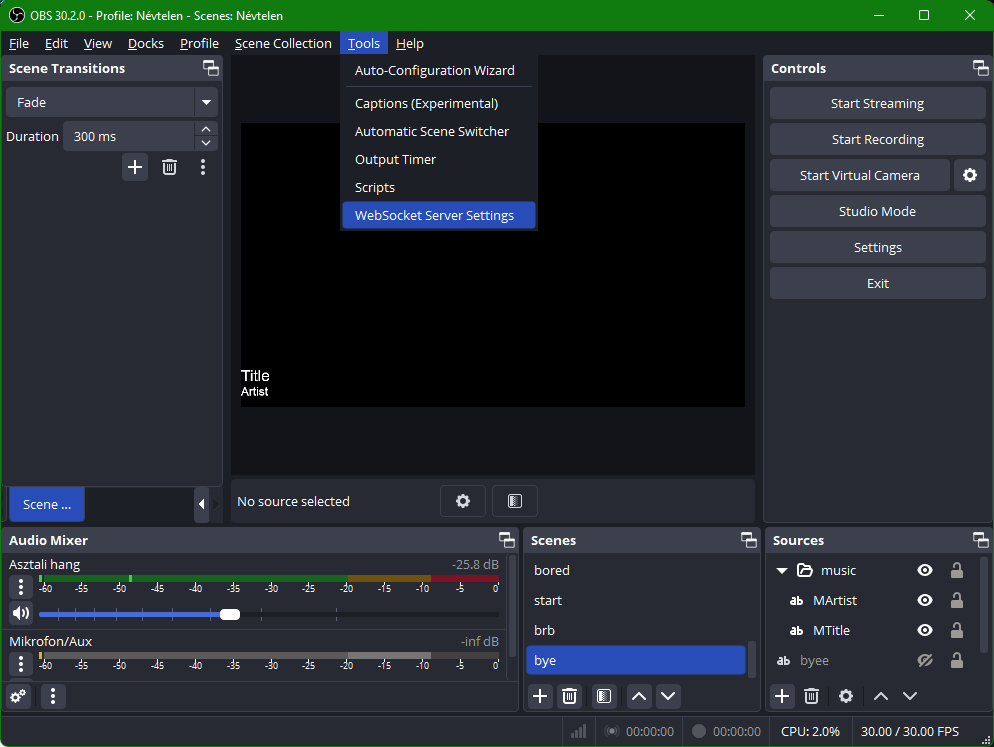
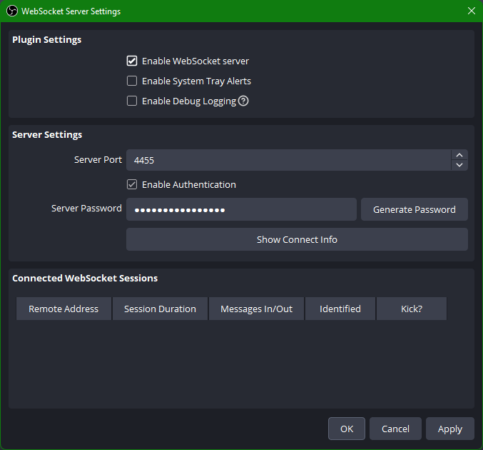
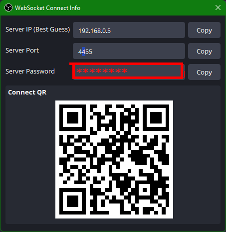
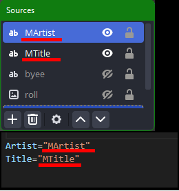

# OBS-music-display
this is a small python code made for displaying music name and it's creator in obs
## instructions
- In OBS go to tools>Websocket server settings

- Enable websocket server and click "show connect info"

- Copy Server password into obspass file

- Edit Title and Artist variables in main.py to the name of text object you want to use

## packages
pip install winsdk

pip install obs-websocket-py 
